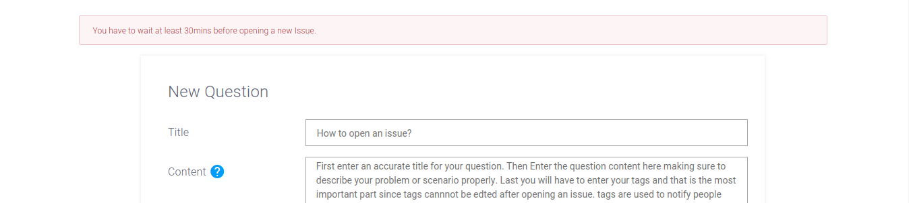
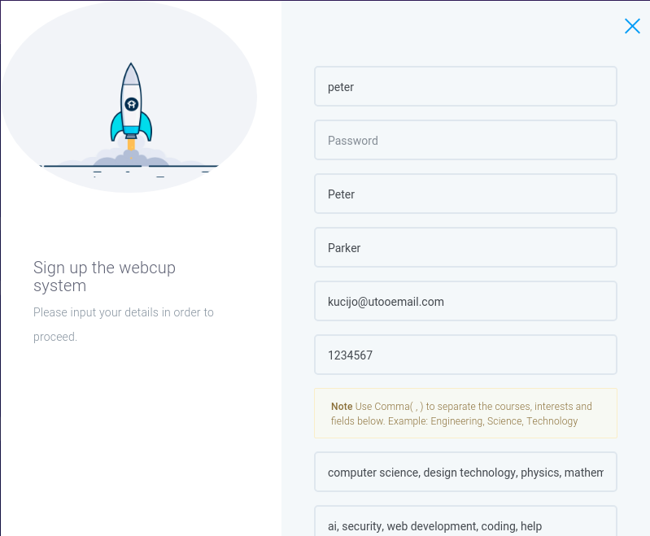
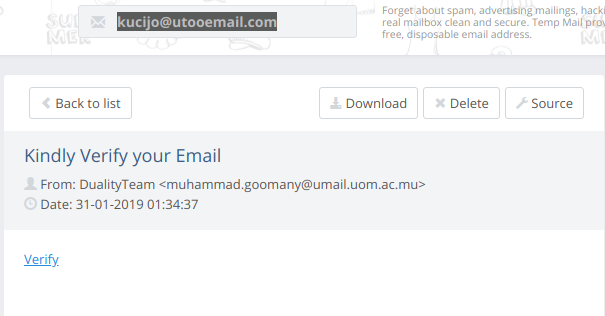

## Duality Portal

### Team

#### Team Name

Duality; derived from [Particle Duality](https://en.wikipedia.org/wiki/Wave%E2%80%93particle_duality)

#### Members

  1. [Nirmal](https://github.com/nirmal-k-r)
  2. [Isfaaq](https://github.com/nirmal-k-r)

---
### Installation - Install Duality

Duality can easily be installed with the following steps:
- Install nodejs from *https://nodejs.org* if you do not have it.
- Rename the file `.env.example` to `.env` from the installation directory.
  1. If you want to host Duality on another port (optional): Edit `PORT=80` at Line 1 in the `.env` file you just renamed.
  
- If you will host Duality on a specific domain(optional): 
  1. Edit `config.js` and replace `http://localhost:` on Line 5 by your domain.
  2. Update captcha key and secret in `.env`. You can get captcha key and secret for your domain at *https://www.google.com/recaptcha/admin#list*.
  
- Run `npm install` from the installation directory.
- Run `node bin/www` from the the installation directory to start Duality.
- Duality will now be available at *http://localhost:80/* if you did not edit the port or domain.


---
### Introduction - Get things Done with Duality

Duality assists you in bringing your ideas to reality:

- Reach Specific Groups
- Get answers to your technical Questions
- Answer queries pertaining to your field of interest
- Broaden your professional circle with the right persons for your projects
- Fine tuned for Mauritius :mauritius:. Some pages are written in Kreol Morisien

---

### Basic functionalities

- Ask questions and reach an appropriate audience
- Edit your questions
- Answer questions
- Upvote a question
- Report a Question
- Share contact information with other users
- Edit your information
- Get notified for relevant changes

### Admin Functionalities

- Ban question
- Ban user
- Promote user to administrator
- View internal Statistics
- All other basic user functionalities

---

### Features

#### Security :lock:

We do not leave you vulnerable!

- Encrypted Password

#### Profanity :anger:

Prevents you from getting carried away by emotions

- *profanity* package provides swear words detection we force you to calm down
- Report a question you deem inapproriate and we'll take care of the rest

**Note:** Currently only the word *damn* is filtered. Other words can be easily added

#### Advanced Spam Protection :robot:

BeepBoop? No! Bots are not allowed here

- reCaptcha? We got it! Verify when registering and posting a question.
- Repeated posting? No, we limit you to one question each 30 minutes 
- Email Verification? Of course

**Note:** Email verification may fail on local host due to hard rebouncing, so we added a button to simulate the verification process. You may also refer to console for the verification URL.





#### Help with the website :children_crossing:

Feeling lost? Not sure about the website? Send us an e-mail

- Functional Contact form, powered by MailJet

#### Express yourself :sparkler:

Plain text is not enough to express your coulourful thoughts?

- Markdown Support when asking questions. [ShowdownJs](http://showdownjs.com) FTW!

#### RESTful Routes

We left some routes open for you to take a sneak peak

- /api/
- /api/questions
- /api/users

---

### Technical Details

#### Stack

- MongoDB
- Express JS
- EJS
- NodeJs

#### Routes

##### Home

- /

##### About

- /about

##### Contact Us

- /contact

##### Login

- /login

##### Question

- /question
- /question/new
- /question/update/:id
- /question/view/:id
- /question/vote/:id
- /question/markread/:id
- /question/contact/:id
- /question/delete/:id
- /question/report/:id
- /question/:id/answer

##### Account

- /account
- /account/update
- /account/updatepw

##### Statistics

- /stats

##### Admin Panel

- /adminpanel
- /adminpanel/manage-users
- /adminpanel/manage-questions
- /adminpanel/updates

#### Models

- users
  * uname
  * token
  * hash


#### Environment Variables

```env
URL=localhost
PORT=3000
CONTACT_MAIL=cdf9fc3e09783ee52f79043322ab8451
CONTACT_MAIL_PASS=29d0432ebda42020b000edef5146e609
MAIL_TO_1=muhammad.goomany@umail.uom.ac.mu
MAIL_TO_2=icyberdivinity@gmail.com
CAPTCHA_SITE_KEY=6LcGtY0UAAAAAJxOkgCoIv1j1EoMrAID_gogJLNi
CAPTCHA_SECRET_KEY=6LcGtY0UAAAAAPLsMtTfrpVFweUcRpZoUAdbjE8f
```